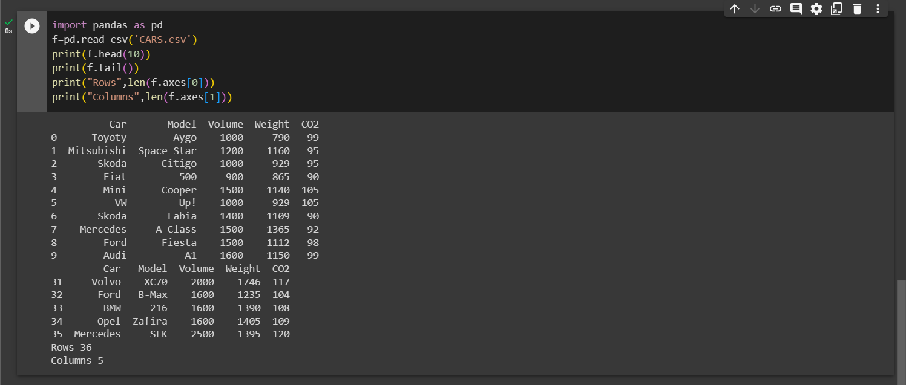

# Read-from-CSV

## AIM:
To write a python program to read from a csv file.
## EQUIPMENT'S REQUIRED:
PC Anaconda - Python 3.7

## ALGORITHM:
### Step 1:
Create a spreadsheet with any details in it with the extension .csv .
### Step 2:
Open Google Colab and mount the drive for using the created file in the Colab.
### Step 3:
Import pandas package as pd for reading the csv file using pd.read_csv(filename).
### Step 4:
Use the functions called head() and tail() for printing the top and bottom of the file and then axes[ ] used for finding the number of rows and columns.
### Step 5:
End the Program.


## PROGRAM:
```python
#Developed by: Krithick Vivekananda
#Register number: 23009445
import pandas as pd
f=pd.read_csv('CARS.csv')
print(f.head(10))
print(f.tail())
print("Rows",len(f.axes[0]))
print("Columns",len(f.axes[1]))
```
## OUTPUT:
Spreadsheet


Mount colab


Output



## RESULT:
Thus the program is written to read the csv file using the package pandas.